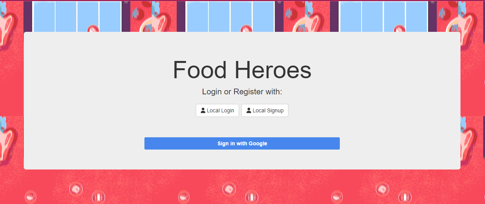
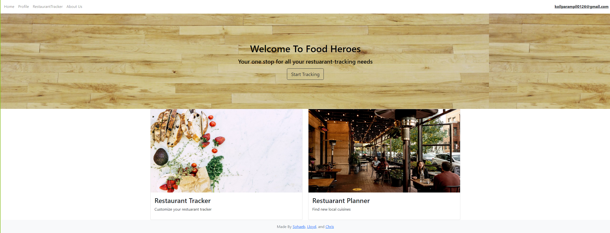
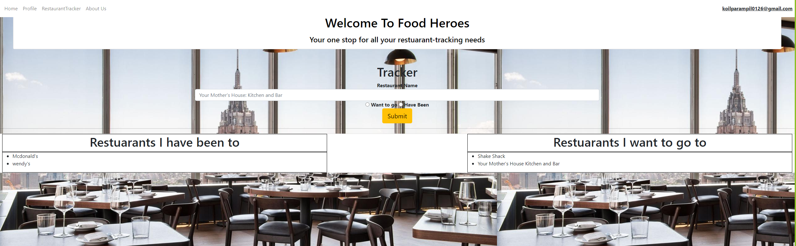

# Food Heroes

## Description

A login based application in which the user can log their favorite resturaunts or resturaunts they'd like to visit.

## Table of Contents

- [Installation](#installation)
- [Deployment](#Deployment)
- [Previews](#Previews)
- [License](#license)

## Installation

For this project you had to install a few NPM package, and you already ahd to have had Node.JS installed. To install the NPM packages all you have to call `npm i` in the terminal at the root of the application and all the necessary packages will automatically be installed for you. 

## Deployment

[FoodHeroes](https://p2foodheroes.herokuapp.com/)

## Previews

## Tests

no tests were performed in the making of this project.

## License

MIT
(https://opensource.org/licenses/MIT)

## Contributors

Soheab Khan

Chris Koilparampil

Lloyd Ting

We would like to thank [manjeshpv](https://github.com/manjeshpv) for getting us started with the local login using passport. We would also like to thank [kriscfoster](https://github.com/kriscfoster) for his help with getting the Google authentication to work by way of his extremely helpful youtube videos.We would like to give a shoutout to Bootstrap and FontAwesome for creating great framworks we could use. The instuctors we worked with were also extremely helpful in helping us in every step along the way.

## Questions

If you have any questions feel free to reach out to us at:
 

[skhangns@gmail.com](mailto:skhangns@gmail.com)

[koilparampil0126@gmail.com](mailto:koilparampil0126@gmail.com)

[llting592@gmail.com](mailto:llting592@gmail.com)

  Or at our GitHubs:

[skhangns](https://github.com/skhangns)

[Koilparampil](https://github.com/Koilparampil)

[llting592](https://github.com/llting592)
